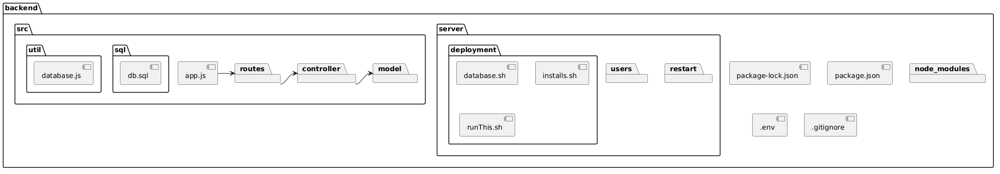

## Proposito
El propósito de este documento es describir la arquitectura de Compospet, estableciendo una base técnica común mediante la unificación de patrones de diseño y estándares de desarrollo.

Funciona como la fuente de verdad para asegurar la calidad del sistema, guiando al equipo actual en la implementación y facilitando el mantenimiento, la resolución de problemas y la evolución del software a largo plazo.

## Ciclo de vida 
| Fase | Objetivo | Actividades principales | Entregables | Criterio de salida |
| :--- | :--- | :--- | :--- | :--- |
| **Inicio** | Comprender el contexto del proyecto y las condiciones de trabajo del parcial | Revisar alcance, backlog inicial, restricciones de tiempo, riesgos conocidos y disponibilidad del SF | Definición inicial del trabajo del parcial, riesgos identificados, insumos para planeación | El equipo cuenta con información suficiente para seleccionar y documentar la forma de trabajo |
| **Planeación de etapa** | Definir cómo se trabajará durante el parcial bajo DAD | Seleccionar el ciclo de vida, definir fases, establecer hitos, organizar backlog y acordar revisiones | Documento de ciclo de vida, backlog priorizado, hitos principales del parcial | El equipo tiene una estructura de trabajo definida y aprobada internamente |
| **Ejecución iterativa** | Desarrollar el trabajo del proyecto en sprints | Planeación de sprint, desarrollo de entregables, seguimiento del trabajo, revisiones periódicas, validaciones y ajustes | Incrementos del proyecto, avances funcionales y documentales, evidencia de seguimiento | Se completa el trabajo comprometido del sprint y se documentan los ajustes necesarios |
| **Revisión y validación** | Verificar el cumplimiento de objetivos y entregables del parcial | Revisar resultados del sprint, validar con TL y stakeholders, identificar ajustes necesarios | Retroalimentación, validaciones, acuerdos de ajuste | Los entregables revisados cumplen con lo esperado o se define una replanificación |
| **Cierre de la etapa** | Consolidar resultados del periodo de trabajo | Documentar entregables finales del parcial, registrar documentación y actualizar la wiki | Entregables finales del parcial, documentación actualizada | El parcial queda formalmente documentado y cerrado |

## Milestones
* Aprobación del ciclo de vida y fases
* Prueba de Arquitectura
* Verificación 
* Validación de avances con stakeholders
* MVP
* MBI 1
* MBI 2
* Capacitaciones MVP, MBI 1 & MBI 2

## ASP 
[Architecture Starter Pack](/Wiki/docs/Aztlan/Nuestros%20Proyectos/Cuitla-Compospet/Artefactos/Manual_Arq/Artefactos_Arquitectura/ASP_Cuitla)

## Factores considerados

### Costo de desarrollo
#### Costo de Mantenimiento
| Periodo | Servidor/mes | Dominio/año | Total Mensual | Total Anual |
| :--- | :--- | :--- | :--- | :--- |
| **Primer año** | $155 | $160 | $169 | $2,020 |
| **Segundo año** | $155 | $327 | $182.25 | $2,187 |
| **Tercer y cuarto año** | $274 | $327 | $301.25 | $3,615 |
| **Quinto año en adelante** | $382 | $327 | $409.25 | $4,911 | 

#### Atributos de calidad
##### 1. Usabilidad
| Atributo / Principio | Requisito y Métrica |
| :--- | :--- |
| **Visibilidad del estatus** | Retroalimentación constante en acciones relevantes (progreso, éxito, falla). |
| **Mundo real** | Lenguaje y simbología no técnica. Flujo de tareas < 5 minutos. |
| **Control y libertad** | Opciones para salir, regresar o cancelar tareas siempre disponibles. |
| **Consistencia** | Estándar de componentes y colores basado en la guía de interfaces de AWS. |
| **Prevención de errores** | Tasa de éxito del 80% en completar tareas asignadas dentro de la web. |
| **Reconocimiento** | Score de 70 en la prueba SUS (System Usability Scale). |
| **Eficiencia** | Carga máx. 3s (móvil/PC) y acceso a información en < 10s (ISO 9241). |
| **Estética** | Interfaz minimalista: máx. 3 colores además de blanco y negro. |
| **Diagnóstico de errores** | Mensajes en lenguaje claro que sugieren una solución al usuario. |
| **Ayuda** | Manual de usuario por cada nivel de acceso basado en atributos (ABAC). |

##### 2. Seguridad
| Categoría | Especificación Técnica |
| :--- | :--- |
| **Auditoría** | Logs de Id, acción y fecha. Registro de login/logout/fallos para Admin. |
| **Autenticación** | Rutas privadas retornan 404 a no autenticados. API Google Authenticator. |
| **Contraseñas** | Mín. 12 caracteres (Mayús, minús, núm, simb). Bloqueo tras 5 intentos (15 min). |
| **Recuperación** | Token de recuperación y activación vía correo con expiración de 15 min. |
| **Autorización** | Control de acceso basado en atributos (ABAC) para rutas, API y datos. |
| **Comunicaciones** | Uso obligatorio de HTTPS. No incluir datos sensibles en parámetros URL. |
| **Criptografía** | Almacenamiento con hash robusto (SHA256, Argon2i o bcrypt). |
| **Excepciones** | Mensajes de error genéricos (OWASP) para no revelar info confidencial. |
| **Sesiones** | Cierre por inactividad (5h cliente / 8h admin). Máximo 2 sesiones simultáneas. |

##### 3. Escalabilidad
| Métrica | Objetivo de Desempeño |
| :--- | :--- |
| **Capacidad Sostenida** | 100 requests por segundo (P95 ≤ 3s). |
| **Manejo de Picos** | 150 requests por segundo por 10 min (degradación máx. 15%). |
| **Crecimiento** | Soportar de 300 a 600 usuarios concurrentes en un horizonte de 2 años. |
| **Monitoreo** | Alertas si CPU > 70% o tiempo de respuesta > 3s por 5 min. |

##### 4. Fiabilidad
| Indicador | Meta de Cumplimiento |
| :--- | :--- |
| **Disponibilidad** | ≥ 98.5% mensual (incluyendo dependencias externas). |
| **Error Rate** | HTTP 5xx no debe superar el 1% en ventanas de 5 minutos. |
| **Resiliencia API** | Timeout de 5s; 3 reintentos automáticos con espera incremental. |
| **MTTF** | Tiempo medio entre fallas de al menos 200 horas. |

##### 5. Modificabilidad
Los cambios relevantes en estructura de la arquitectura del sistema deberán documentarse mediante decisiones de arquitectura (ADR) y diagramas mínimos actualizados.

El sistema deberá estar organizado en módulos con funcionalidades claras que permitan agregar o sustituir integraciones externas (APIs) o componentes específicos sin afectar la funcionalidad de la arquitectura.

##### 6. Desempeño (Web Vitals)
| Métrica | Umbral (Threshold) | Descripción |
| :--- | :--- | :--- |
| **LCP** | ≤ 2.5 segundos | Tiempo de carga del contenido principal. |
| **Speed Index** | 0 - 1.3 segundos | Rapidez visual durante la carga. |
| **CLS** | ≤ 0.1 | Estabilidad visual del diseño (sin saltos). |
| **INP** | ≤ 200 milisegundos | Capacidad de respuesta a interacciones. |
| **TTFB** | ≤ 0.8 segundos | Tiempo de respuesta del primer byte del servidor. |

##### 7. Accesibilidad
Se tomará como base la documentación de Web.dev: https://web.dev/performance, que a su vez se basa en las evaluaciones del impacto en el usuario de Axe.
Para medirlo y analizarlo se utilizará la página de PageSpeed Insights https://pagespeed.web.dev/

Axe-core cuenta con diferentes tipos de reglas para WCAG 2.0, 2.1 y 2.2 en los niveles A, AA y AAA, así como con una serie de prácticas recomendadas que ayudan a identificar prácticas comunes de accesibilidad. Al usar la librería, en promedio, el 57 % de los problemas de WCAG se resuelven automáticamente. Además, para detectar errores mientras vamos desarrollando, usaremos la extensión axe-linter de VSCode. 

##### 8. Portabilidad
| Navegador | Soporte de Versiones |
| :--- | :--- |
| **Chrome / Android** | Versión actual + 4 versiones futuras. |
| **Microsoft Edge** | Versión actual + 4 versiones futuras. |
| **Safari / iOS** | Versión actual + 2 versiones futuras. |

#### Complejidad del sistema
| Módulos ↓ | Landing | Inicio Sesión | Clientes | Formulario | Ruta | Pagos | Recordatorios |
| :--- | :---: | :---: | :---: | :---: | :---: | :---: | :---: |
| **Landing** | - | | | | | | |
| **Inicio Sesión** | X | - | | | | | |
| **Tabla Clientes** | | X | - | | | | |
| **Formulario** | | X | X | - | X| X| |
| **Tabla Ruta** | | X | X |X | - | | |
| **Pagos** | | X | X | | | - |X |
| **Recordatorios** | | X | X | |  |X| - |
#### Robustez
* [Mitigación de riesgos](https://drive.google.com/drive/folders/1-sY_fcFZMAHglTi_jbGFmRfS-NRvrJpJ?usp=sharing)
* Diagrama de Flujo de Datos

#### Limitaciónes de Tecnologías
    - [Base de skills](https://docs.google.com/spreadsheets/d/1fTEIn50jTNEAErV28CrP1KxcjjsE_eJUXX-Y_yDiCIM/edit?gid=0#gid=0)
- Riesgos
    - [Matriz de riesgos](https://docs.google.com/spreadsheets/d/1PyHPAv7n_Ok2TyG7pxqiGVQXgGVu5A58DYE56uI0Wo4/edit?gid=1206113592#gid=1206113592)
#### Evolución futura
    - [Estrategia de desarollo](https://docs.google.com/document/d/1PoOLtvvigEFOjN5cPRgTm9IPhmUepv2hTL0bc0cRz4I/edit?tab=t.0)

## Stack Recomendado
[Stack](../Manual_Arq/Artefactos_Arquitectura/Stack_recomendado.md          )

##  ADRs

- [ADR-01 Servidor Hostinger](../Artefactos_Arquitectura/ADRs/ADR-01%20Servidor%20Hostinger.md)
- [ADR-02 Sistema Operativo](../Artefactos_Arquitectura/ADRs/ADR-02%20SistemaOperativo.md)
- [ADR-03 Firewall WAF Cloudflare](../Artefactos_Arquitectura/ADRs/ADR-03%20Firewall.md)
 

## Diagrama de Despliegue 
[Diagrama de despliegue](https://drive.google.com/drive/folders/1unCmhpQJstqL7ZR0USmDIarhOaIjlOVT)

## Patrón de Arquitectura
- Clean Architecture
    - Back
        - **MVC**  
        Por otro lado, el backend seguirá el patrón de arquitectura [Modelo Vista Controlador (MVC)](https://codigofacilito.com/articulos/mvc-model-view-controller-explicado), el cual separa la lógica de negocio, la gestión de datos y el manejo de las solicitudes del usuario, permitiendo una estructura más modular y mantenible del sistema.  
        **Diagrama de Paquetes**  
        
        [Diagrama de paquetes texto](../Entregables/diagrama_paquetes.plantuml)
        
    - Front
        - **MVVM** 
        En el frontend se implementará la arquitectura [Model View ViewModel (MVVM)](https://learn.microsoft.com/en-us/dotnet/architecture/maui/mvvm), la cual permite separar la interfaz de usuario de la lógica de presentación y de los datos, facilitando una mejor organización del código y una actualización reactiva de la interfaz.    Se hará un spike de react para realizar el diagrama de paquetes del frontend. 

## Plan de recursos
- [Plan de recursos](https://docs.google.com/document/d/1Yih3CBKonNiYRsPUfO8lJsYRYNXJTQccyRpao51t2TM/edit?tab=t.0)

### Tutoriales o Spikes relacionados
- Los que creemos 
- De lo que queremos aprender

## Prueba de Arquitectura

- Planeación de prubea arquitectura

## Estrategia de integración continua
### Flujo de integración - Procedimientos

### Estandares de Codificación  
Para los estándares de codificación del proyecto se utilizará JavaScript, siguiendo las buenas prácticas definidas en la Airbnb JavaScript Style Guide, la cual establece convenciones para la estructura del código, la nomenclatura de variables y funciones, así como reglas de estilo que permiten mantener un código consistente, legible y mantenible a lo largo del desarrollo.   

Para el cumplimiento de estos estándares, se utilizará ESLint como herramienta de análisis estático de código, la cual permite detectar posibles errores y malas prácticas durante el desarrollo. Esta herramienta ayuda a aplicar reglas de estilo, mantener la consistencia del código y promover buenas prácticas en JavaScript, contribuyendo a mejorar la calidad y mantenibilidad del software.  

Adicionalmente, se utilizará un formateador de código, Prettier, cuya función es organizar el código visualmente para mantener un estilo uniforme en todo el proyecto. Esta herramienta permitirá controlar aspectos como los espacios, saltos de línea, uso de comillas simples o dobles, punto y coma e indentación, facilitando la legibilidad y consistencia del código.

### Criterios de aceptación

**Definición de Ready ( DoR ) - ComposPet**

- Tamaño pequeño: La historia ya no se puede descomponer en más actividades. Es lo suficientemente pequeña y manejable para sacarla completa dentro de un sprint. 
- Redacción clara: La historia de usuario está redactada con el enfoque tradicional de Card, Conversation, Confirmation: Como [ tipo de usuario ], quiero [ funcionalidad ] para [ beneficio ]. 
- Estimación y prioridad: La historia de usuario cuenta con una prioridad y estimación del esfuerzo que se requeriría  basada en story points en el backlog del equipo.  
- Sin dependencias: Las dependencias con otras historias de usuario han sido identificadas y resueltas
- Diagramas: La historia de usuario cuenta con diagramas (secuencia, componentes, estados, BPMN, Tablas de decisión, etc..) 
- Dependencias Spikes: Si la historia depende de un spike, este debe estar concluido con resultados claros.  
- Interfaz en figma: La interfaz cumple con los diseños en Figma que han sido aprobados por el cliente.   

**Definición de Done ( DoN ) - ComposPet** 

Basada en la definición de Done del departamento:

Una funcionalidad es aceptada [DONE] cuando:  
- Cumple con ready: La historia de usuario cumple con la definición de ready.  
- Trazabilidad:La función tiene su respectiva trazabilidad en la RTM (Matriz de Trazabilidad de Requisitos). 
- Pruebas de integración: Pasa todas las pruebas de integración. 
- PRs aprobados: Los PR's (Pull Requests) ya fueron creados, revisados y aceptados siguiendo los lineamientos que acordamos. 
- Código limpio: Cumple con los estándares de codificación establecidos.  
- Seguridad: Se cumplieron los estándares de seguridad (encriptación, manejo de contraseñas). 
- Documentación: El código está documentado.  
- Aprobado por el cliente: La funcionalidad ha sido demostrada y aceptada por el cliente. 
- Cumple pruebas: El código cumple con la cobertura de las pruebas unitarias en al menos un 80%. 

### Pruebas Unitarias
- Se implementarán pruebas unitarias para verificar el correcto funcionamiento de funciones y módulos individuales del sistema. 
- Estas pruebas se desarrollarán utilizando Jest, permitiendo validar de forma aislada la lógica del sistema desarrollada en JavaScript.  

### Pruebas de Integración
- Se implementarán pruebas de integración para validar la interacción entre los diferentes componentes del sistema, asegurando que los módulos funcionen correctamente cuando se integran entre sí.  
- Estas pruebas también se ejecutarán mediante Jest y se automatizarán utilizando GitHub Actions, permitiendo su ejecución automática en cada actualización del sistema. 

### Ambientes de despliegue
El proyecto utilizará una estrategia de ramas para organizar el desarrollo y garantizar la estabilidad del código en cada etapa del proceso. 

#### Prod
- Contendrá código estable y listo para desplegar en producción.
- No se permitirán commits directos en esta rama.
- Solo recibirá merges aprobados desde la rama **Staging**.
- Esta rama deberá estar protegida para evitar modificaciones no autorizadas.

#### Staging
- En esta rama se validarán funcionalidades completas antes de su liberación.
- Puede recibir merges desde la rama **Develop**.
- Después de verificar que las funcionalidades operan correctamente en este ambiente, se podrá realizar el *merge* hacia la rama **Prod**.

#### Develop
- Rama principal de desarrollo.
- Aquí se integrarán todas las ramas de **feature**.
- Una vez que las funcionalidades se encuentren completas y probadas, se podrán integrar a la rama **Staging**.

## Glosario

**MVC (Modelo Vista Controlador)**  
Patrón de arquitectura que separa la aplicación en tres componentes principales: modelo, vista y controlador.

**MVVM (Model View ViewModel)**  
Patrón de arquitectura que separa la lógica de presentación de la interfaz de usuario mediante el uso de un ViewModel.

**ADR (Architecture Decision Record)**  
Documento que registra decisiones importantes relacionadas con la arquitectura del sistema.

**Spike**  
Actividad de investigación técnica utilizada para explorar una solución o tecnología antes de implementarla.

**Pull Request (PR)**  
Solicitud para integrar cambios de una rama a otra dentro de un repositorio de código.

**RTM (Requirements Traceability Matrix)**  
Matriz que permite rastrear la relación entre requisitos, desarrollo y pruebas.

**Integración Continua (CI)**  
Práctica de desarrollo en la que los cambios de código se integran frecuentemente en el repositorio principal y se validan automáticamente mediante pruebas.

**Pruebas Unitarias**  
Pruebas que verifican el funcionamiento de componentes individuales del sistema.

**Pruebas de Integración**  
Pruebas que verifican la interacción entre diferentes componentes del sistema.

## Referencias
## Referencias

- [Postgres vs MongoDB – Bytebase](https://www.bytebase.com/blog/postgres-vs-mongodb/)
- [Diferencia entre bases de datos ACID y BASE – AWS](https://aws.amazon.com/es/compare/the-difference-between-acid-and-base-database/)
- [Choosing MongoDB vs PostgreSQL Cloud Database Solutions – EnterpriseDB](https://www.enterprisedb.com/choosing-mongodb-postgresql-cloud-database-solutions-guide)
- [MongoDB vs PostgreSQL Comparison – MongoDB](https://www.mongodb.com/resources/compare/mongodb-postgresql)
- [Discussion: PostgreSQL vs MongoDB – Reddit](https://www.reddit.com/r/PostgreSQL/comments/19bkn8b/doubt_regarding_postgresql_vs_mongodb/?tl=es-419)
- [Difference Between MongoDB and PostgreSQL – AWS](https://aws.amazon.com/es/compare/the-difference-between-mongodb-and-postgresql/)
- [Requerimientos de Software Nuclea 1.0](https://docs.google.com/document/d/1sUATBxqH3TbwqfV5jSE0gygfIeTC9kQua0CND8ov9GM/edit?tab=t.0)
- [PLA10 – Plantilla para redactar un documento de compromiso](https://docs.google.com/document/d/1U3Xf4u492_j3Labn_bFUKl9OH12SOf43LL1bN_Lk6Vw/edit?tab=t.dmvhdli3c9vb)
- [SRS – ComposPet](https://docs.google.com/document/d/1YoU9wY4nDRIAOOuGRMDbNJV5Vhgw3qolXyaR-Va28L0/edit?tab=t.0)
- [Cloudflare](https://www.cloudflare.com/)
- [Cloudflare Web Application Firewall (WAF)](https://www.cloudflare.com/es-es/application-services/products/waf/)
- [Hostinger VPS Hosting](https://www.hostinger.com/mx/vps-hosting)
- [Parámetros y límites de planes de hosting en Hostinger](https://www.hostinger.com/support/6976044-parameters-and-limits-of-hosting-plans-in-hostinger/#h_0fbdbe1ac8)
- [Presentación del proyecto](https://docs.google.com/presentation/d/17J0F4BSO5mRLJnsqmdc9MaKvIalAG5t20JZP7ISTf8c/edit?slide=id.g402ad65d92_0_314#slide=id.g402ad65d92_0_314)
- [React Documentation](https://react.dev/)
- [Ubuntu](https://ubuntu.com/)
- [Manual de Arquitectura General – CaveLabs](https://github.com/CaveLabs-1/Wiki/blob/master/Arquitectura/Manuales/Manual%20Arquitectura%20General.md)
- [Technology Stack – dwyl](https://github.com/dwyl/technology-stack)
- [Acta Proyecto Zeitgeist](https://black-dot-2024.github.io/docs/zeitgeist/acta-proyecto-ZG)

---

| Version | Creado por: | Auditado por: | Descripción | Fecha |
|---------|------------|--------------|---------------|-------|
| 1.0 | Yessica Lora | Fernanda Valdez |    | 10/03/2026 |