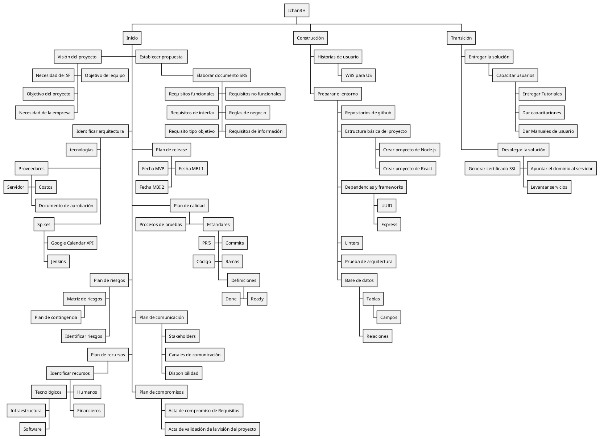

Código PUML

[WBS para historias de usuario](./WBSUserStories.md)

| Version | Creado por: | Auditado por: | Descripción | Fecha |
|---------|------------|--------------|---------------|-------|
| 1.0 | Yael Charles y Manuel Bajos | Edmundo Canedo | Creación del WBS | 27/02/2026 |
| 1.1 | Yael Charles | Marco Ivan | Cambiar formato del WBS y simplificar | 09/03/2026|