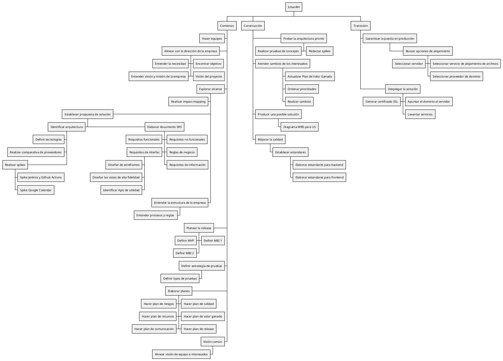

Código PUML

| Version | Creado por: | Auditado por: | Descripción | Fecha |
|---------|------------|--------------|---------------|-------|
| 1.0 | Yael Charles y Manuel Bajos | Edmundo Canedo | Creación del WBS | 27/02/2026 |