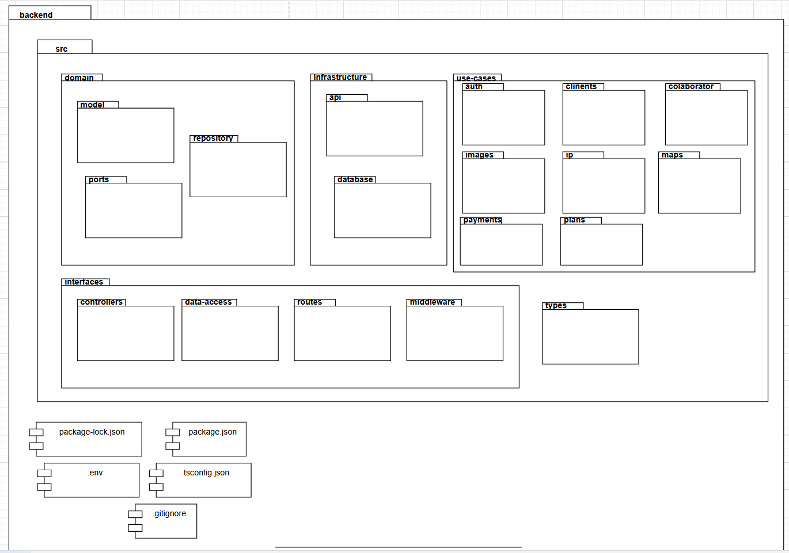
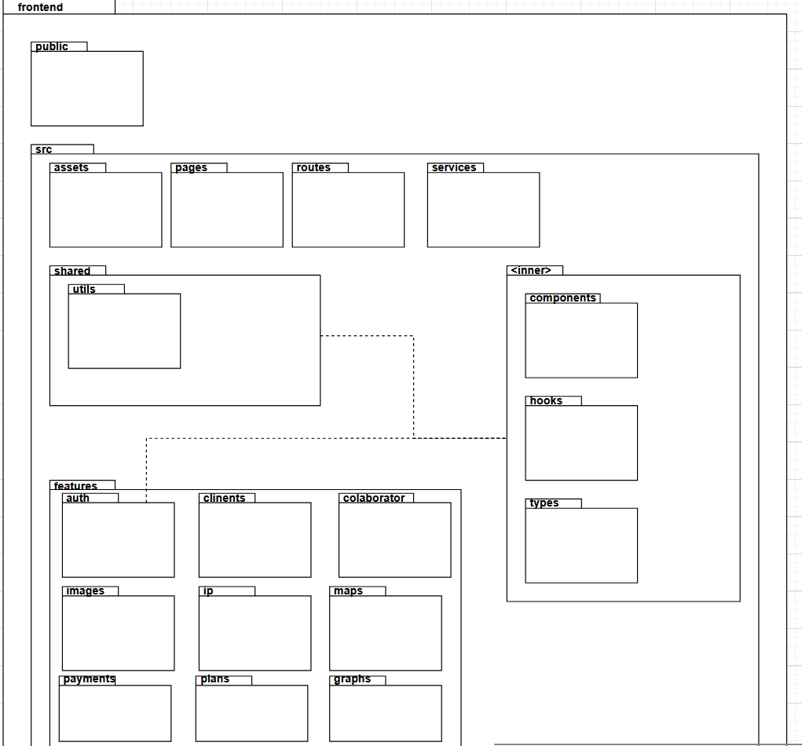

## Proposito

Guía de instalación y mantenimiento del proyecto de SOS.
Documentar y describir la arquitectura de la aplicación, funcionamiento, módulos, y establecimiento de estándares seguidos para el desarrollo.

## Ciclo de vida

| Fase                      | Objetivo                                                        | Actividades principales                                                                                   | Entregables                                                                                             | Criterio de salida                                                                                                                                              |
| :------------------------ | :-------------------------------------------------------------- | :-------------------------------------------------------------------------------------------------------- | :------------------------------------------------------------------------------------------------------ | :-------------------------------------------------------------------------------------------------------------------------------------------------------------- |
| **Inicio**                | Comprender contexto del proyecto, necesidades y objetivos       | Identificar restricciones, recursos, disponibilidad de los miembros interesados                           | Riesgos identificados, Presupuesto, calendario                                                          | Se cuenta con un plan de acción para empezar planeación, equipo de trabajo, se identificó la necesidad, objetivo y se tiene una idea de qué se tiene que hacer. |
| **Planeación de etapa**   | Definir alcance del proyecto y calcular esfuerzo                | Priorizar backlog de actividades, registro de actividades                                                 | PVG, Backlog                                                                                            | Se cuenta con un plan de trabajo, tareas y la socia ha aceptado el plan y alcance                                                                               |
| **Ejecución iterativa**   | Generar valor para el cliente                                   | Diseño, desarrollo, pruebas, implementación                                                               | Funciones del proyecto, documentación, actualizaciones backlog/pvg                                      | Fin del sprint                                                                                                                                                  |
| **Revisión y validación** | Identificar errores en etapas tempranas del ciclo de desarrollo | Reuniones con la socia, peer revision, verificación de calidad y validación de relevancia y funcionalidad | Reportes de evaluación de calidad, backlog actualizado, cambios que se tienen que hacer o cómo se hacen | Hay responsables para abordar los cambios, se tiene una expectativa para la siguiente revisión                                                                  |

## Milestones

- Aprobación de parte de la socia sobre el alcance del proyecto
- Prueba de arquitectura
- Verificación
- Validación con la socia
- MVP
- MBI 1
- MBI 2

## ASP

[Poner el Architecture Starter Pack del Proyecto](./Artefactos_Arquitectura/ASP_Xolotl.md)

## Factores considerados

- No hay reembolsos.
- Solo Administradora y colaboradoras tienen acceso a las cuentas de Meta.
- Priscilla es la única que puede crear anuncios.
- Colaboradoras son compensadas por la cantidad de mensajes que promocionan.
- Registro de una mascota debe contener nombre de la mascota, máximo 4 fotos, y ubicación en la que se perdió.
- Sólo operan en países de habla hispana (América Latina y España).
- Para cada plan disponible, se desbloquearán cierto beneficios dependiendo del nivel.
- Un cliente puede avisar de que su mascota ha sido encontrada.
- Si una mascota no fue encontrada al final de su plan, un cliente puede pedir una extensión a un precio con descuento.

### Costo de desarrollo

- 1020 horas de trabajo

#### Costo de Mantenimiento

| Periodo                    | Servidor/mes      | Dominio/año | Total Mensual | Total Anual |
| :------------------------- | :---------------- | :---------- | :------------ | :---------- |
| **Primer año**             | $178.14 ($10 USD) | $178.14     | $356.28       | $2,315      |
| **Segundo año**            | $178.14           | $178.14     | $356.28       | $2,315      |
| **Tercer y cuarto año**    | $356.27 ($20 USD) | $178.14     | $534.41       | $4,275.24   |
| **Quinto año en adelante** | $356.27           | $178.14     | $534.41       | $4,275.24   |

#### Atributos de calidad

##### 1. Usabilidad

- El sistema debe permitir hacer el reporte de mascota perdida en 5 minutos.
- La plataforma debe ser responsiva a dispositivos móviles (428x926px).
- El precio se ajusta a la moneda local automáticamente.

##### 2. Seguridad

- Sistema de acceso basado en atributos: ABAC.
- Encriptación de datos personales (Nombre, teléfono, nombre de mascota, usuario de facebook, contraseña).
- Comunicación con la aplicación tiene que ser por HTTPS.

##### 3. Fiabilidad

- Se debe poder contratar un servicio sin importar la hora del día el 99\% del tiempo.

##### 4. Modificabilidad

- Arquitectura MVC para el backend.
- Arquitectura Atómica para el front-end.
- Seguir estándares de código de [Airbnb](https://github.com/airbnb/javascript)

##### 5. Desempeño (Web Vitals)

- La página principal debe cargar en menos de 3 segundos con una conexión a internet estable.
- El sistema debe ser capaz de soportar a 500 usuarios concurrentes para el MVP.

##### 6. Portabilidad

- El sistema debe funcionar en los navegadores Chrome (v146) y Safari (v26.3).
- El sistema debe funcionar correctamente en dispositivos iOS, Android y de escritorio (428x926 - 412x883).

#### Complejidad del sistema

| Módulos ↓ | Landing | Inicio Sesión | Clientes | Formulario | Ruta | Pagos | Recordatorios |
| :-------- | :-----: | :-----------: | :------: | :--------: | :--: | :---: | :-----------: |

#### Robustez

- [Mitigación de riesgos](https://docs.google.com/spreadsheets/d/1rQQRWQqWzgMJ_X6eNkf-8GB7miFwvbvKIsUrwZWUeDo/edit?usp=sharing)

<!-- - Diagrama de Flujo de Datos -->

#### Limitaciónes de Tecnologías

    - [Base de skills](https://docs.google.com/spreadsheets/d/1fTEIn50jTNEAErV28CrP1KxcjjsE_eJUXX-Y_yDiCIM/edit?usp=sharing)

- **Riesgos**
  - [Matriz de riesgos](https://docs.google.com/spreadsheets/d/1OtUU3JiI-ShuwNsPVxBTGs9G1-0PnEH7Ge06MCaN8dk/edit?usp=sharing)

#### Evolución futura

    - [Estrategia de desarollo](https://docs.google.com/document/d/1IrLcLrhL_BlwbuCQSJwNfDiLMErx0dFlX-gS1IelSJM/edit?usp=sharing)

## Stack

[Stack](./Artefactos_Arquitectura/Stack.md)

## ADRs

- [ADR-01 Weaviate](./Artefactos_Arquitectura/ADRs/ADR-1.md)
- [ADR-02...]()

## Diagrama de Despliegue

[Diagrama de despliegue](https://drive.google.com/file/d/1bhTWiKTjYgwSQsQ0IXbU5PYQX546gMJn/view?usp=sharing)

## Patrón de Arquitectura

- Clean Architecture
  - Back
    - **MVC**  
      **Diagrama de Paquetes**  
      
      [Imagen de diagrama de paquetes](https://drive.google.com/file/d/1hvADhw1wNgfdJg-d2UJGX_qcsxzKLpBl/view?usp=sharing)
  - Front
    - **Atomic design**

    **Diagrama de Paquetes**  
    
    [Imagen de diagrama de paquetes Front](https://drive.google.com/file/d/1hvADhw1wNgfdJg-d2UJGX_qcsxzKLpBl/view?usp=sharing)

## Plan de recursos

- [Plan de recursos](https://docs.google.com/document/d/14vN-y7ePfldHozCVjnzgmwYVmlwoD7Rg6rgdZzJXTJw/edit?usp=sharing)

### Tutoriales o Spikes relacionados

## Prueba de Arquitectura

- [Planeación de prubea arquitectura](./Artefactos_Arquitectura/Prueba_Arquitectura.md)

## Estrategia de integración continua

### Flujo de integración - Procedimientos

### Estandares de Codificación  

- [Airbnb](https://github.com/airbnb/javascript)

### Criterios de aceptación

**Definición de Ready ( DoR ) - Xólotl**
Ready
Una funcionalidad está en estado Ready o lista para desarrollo cuando:
Esta redactada como US.
Cuenta con interfaz de alta fidelidad
Cuenta con casos de prueba redactados
La historia de usuario es unitaria (El trabajo está estimado de ser no mayor a un día y no depende de otra que no ha sido realizada)

**Definición de Done ( DoN ) - Xólotl** 
Una funcionalidad es aceptada [DONE] cuando
La función tiene trazabilidad en la RTM
Pasa todas las pruebas de integración
Tiene una prueba automática unitaria de la función (Por lo menos backend)
Se creó y aceptó el PR bajo los lineamientos superiores
La función se integró correctamente con el código sin generar errores posteriores

### Pruebas Unitarias

- Se implementan pruebas unitarias para verificar el correcto funcionamiento de las funciones de la aplicación y para las pruebas de regresión, asegurando que ninguna nueva función rompa las anteriores

- Estas pruebas serán codificadas por medio de Jest

### Pruebas de Integración

- Prueba que comprueba que los diferentes módulos pueden trabajar en conjunto sin ocasionar problemas

### Ambientes de despliegue

El proyecto contará con las siguientes ramas para tener una organización, y asegurar el correcto funcionamiento de las versiones y trazabilidad de su progreso.

#### Prod

- Rama activa y abierta al público, es la versión útil de la aplicación con infomración real de usuarios y con la que aquellos pueden interactuar.

#### Staging

- Rama de pruebas y comprobación antes de subir a producción, solo se resuelven errores críticos en esta rama, pero no se desarrolla.
- Cuando la versión se considera estable se une con la versión de producción

#### Develop

- Versión viva de la aplicación donde se van integrando y provando los cambios

## Glosario

MVC (Modelo Vista Controlador)
Patrón de arquitectura que separa la aplicación en tres componentes principales: modelo, vista y controlador.

ADR (Architecture Decision Record)
Documento que registra decisiones importantes relacionadas con la arquitectura del sistema.

Spike
Actividad de investigación técnica utilizada para explorar una solución o tecnología antes de implementarla.

Pull Request (PR)
Solicitud para integrar cambios de una rama a otra dentro de un repositorio de código.

RTM (Requirements Traceability Matrix)
Matriz que permite rastrear la relación entre requisitos, desarrollo y pruebas.

Integración Continua (CI)
Práctica de desarrollo en la que los cambios de código se integran frecuentemente en el repositorio principal y se validan automáticamente mediante pruebas.

Pruebas Unitarias
Pruebas que verifican el funcionamiento de componentes individuales del sistema.

Pruebas de Integración
Pruebas que verifican la interacción entre diferentes componentes del sistema.

## Referencias

---

| Version | Creado por:      | Auditado por:   | Descripción | Fecha      |
| ------- | ---------------- | --------------- | ----------- | ---------- |
| 0.0     | Yessica Lora     | Fernanda Valdez |             | 10/03/2026 |
| 1.0     | Santiago Alducin |                 |             | 06/04/2026 |
| 1.1     | Santiago Alducin |                 |             | 11/04/2026 |
