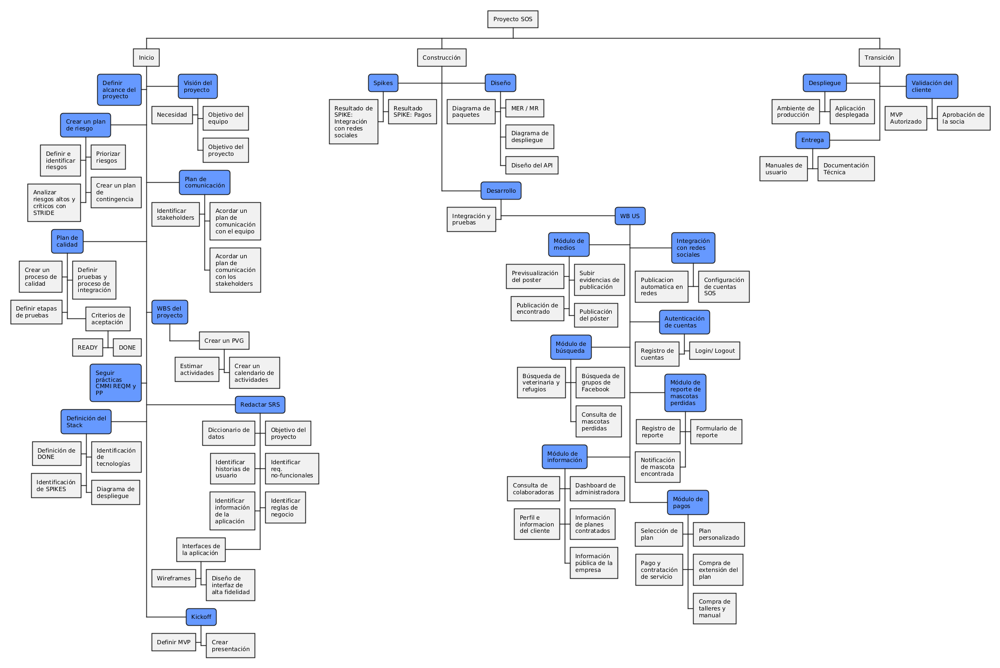
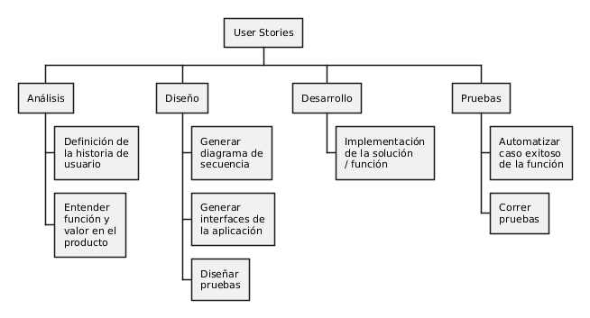

_v1.0_

# WBS (Work Breakdown Structure)

## • WBS del Proyecto

<details>
<summary>Código PUML</summary>
```puml
@startwbs
skinparam defaultFontSize 11
skinparam wrapWidth 80

<style>
wbsDiagram {
  .top {
    BackgroundColor #6699FF
    RoundCorner 10
  }
}
</style>

- Proyecto SOS

** Gestión del proyecto \*** Minutas de reuniones
\*\*\*< Control de versiones de documentación

** Inicio \*** Visión del proyecto <<top>> \***\*< Necesidad
\*\*** Objetivo del equipo \***_ Objetivo del proyecto
_** Plan de comunicación <<top>> \***\*< Identificar stakeholders
\*\*** Acordar un plan de comunicación con el equipo \***_ Acordar un plan de comunicación con los stakeholders
_** WBS del proyecto <<top>> \***\* Crear un PVG
\*\*\***< Estimar actividades
**\*** Crear un calendario de actividades
**_< Definir alcance del proyecto <<top>>
_** Redactar SRS <<top>> \***\*< Diccionario de datos
\*\*** Objetivo del proyecto \***\*< Identificar historias de usuario
\*\*** Identificar req. no-funcionales \***\*< Identificar información de la aplicación
\*\*** Identificar reglas de negocio \***\*< Interfaces de la aplicación
\*\*\***< Wireframes
**\*** Diseño de interfaz de alta fidelidad
**\*< Crear un plan de riesgo <<top>>
\*\***< Definir e identificar riesgos \***\* Priorizar riesgos
\*\***< Analizar riesgos altos y críticos con STRIDE \***_ Crear un plan de contingencia
_**< Plan de calidad <<top>> \***\*< Crear un proceso de calidad
\*\*** Definir pruebas y proceso de integración \***\*< Definir etapas de pruebas
\*\*** Criterios de aceptación
**\***< READY
**\*** DONE
**_< Seguir prácticas CMMI REQM y PP <<top>>
_**< Definición del Stack <<top>> \***\*< Definición de DONE
\*\*** Identificación de tecnologías \***\*< Identificación de SPIKES
\*\*** Diagrama de despliegue
**\* Kickoff <<top>>
\*\***< Definir MVP
\*\*\*\* Crear presentación

** Construcción \***< Spikes <<top>> \***\*< Resultado de SPIKE: Integración con redes sociales
\*\*** Resultado SPIKE: Pagos
**\* Diseño <<top>>
\*\*** MER / MR \***\*< Diagrama de paquetes
\*\*** Diagrama de despliegue \***_ Diseño del API
_** Desarrollo <<top>> \***\*< Integración y pruebas
\*\*** WB US <<top>>
**\*** Integración con redes sociales <<top>>
**\*\***< Publicacion automatica en redes
**\*\*** Configuración de cuentas SOS
**\*** Autenticación de cuentas <<top>>
**\*\***< Registro de cuentas
**\*\*** Login/ Logout
**\***< Módulo de medios <<top>>
**\*\***< Previsualización del poster
**\*\*** Subir evidencias de publicación
**\*\*** Publicación del póster
**\*\***< Publicación de encontrado
**\*** Módulo de reporte de mascotas perdidas <<top>>
**\*\***< Registro de reporte
**\*\*** Formulario de reporte
**\*\***< Notificación de mascota encontrada
**\***< Módulo de búsqueda <<top>>
**\*\*** Búsqueda de grupos de Facebook
**\*\***< Búsqueda de veterinaria y refugios
**\*\*** Consulta de mascotas perdidas
**\*** Módulo de pagos <<top>>
**\*\***< Selección de plan
**\*\*** Plan personalizado
**\*\***< Pago y contratación de servicio
**\*\*** Compra de extensión del plan
**\*\*** Compra de talleres y manual
**\***< Módulo de información <<top>>
**\*\*** Dashboard de administradora
**\*\***< Consulta de colaboradoras
**\*\*** Información de planes contratados
**\*\***< Perfil e informacion del cliente
**\*\*** Información pública de la empresa

** Transición \***< Despliegue <<top>> \***\*< Ambiente de producción
\*\*** Aplicación desplegada

**\* Validación del cliente <<top>>
\*\*** Aprobación de la socia
\*\*\*\*< MVP Autorizado

**\*< Entrega <<top>>
\*\***< Manuales de usuario
\*\*\*\* Documentación Técnica

@endwbs

````
</details>



## • WBS de User Stories

<details>
<summary>Código PUML</summary>
```puml
@startwbs
* User Stories
** Análisis
*** Definición de la historia de usuario
*** Valor de la US
*** Estimación de trabajo
*** Responsable
** Diseño
*** Diagrama de actividades
*** Diagrama de secuencia
*** Interface de la aplicación
*** Pruebas de integración
*** Pruebas unitarias
** Desarrollo
*** Rutas
*** Interfaces lógicas
*** Integración con base de datos
*** Front-end
** Pruebas
*** Pruebas Unitarias
*** Pruebas de función
*** Pruebas de integración
@endwbs
````

</details>



| Version | Creado por:      | Auditado por:   | Descripción      | Fecha      |
| ------- | ---------------- | --------------- | ---------------- | ---------- |
| 1.0     | Santiago Alducin | Sebastián Pérez | Creación Inicial | 28/02/2026 |
| 1.1     | Santiago Alducin | Jorge Garzón    | Correcciones     | 09/03/2026 |
