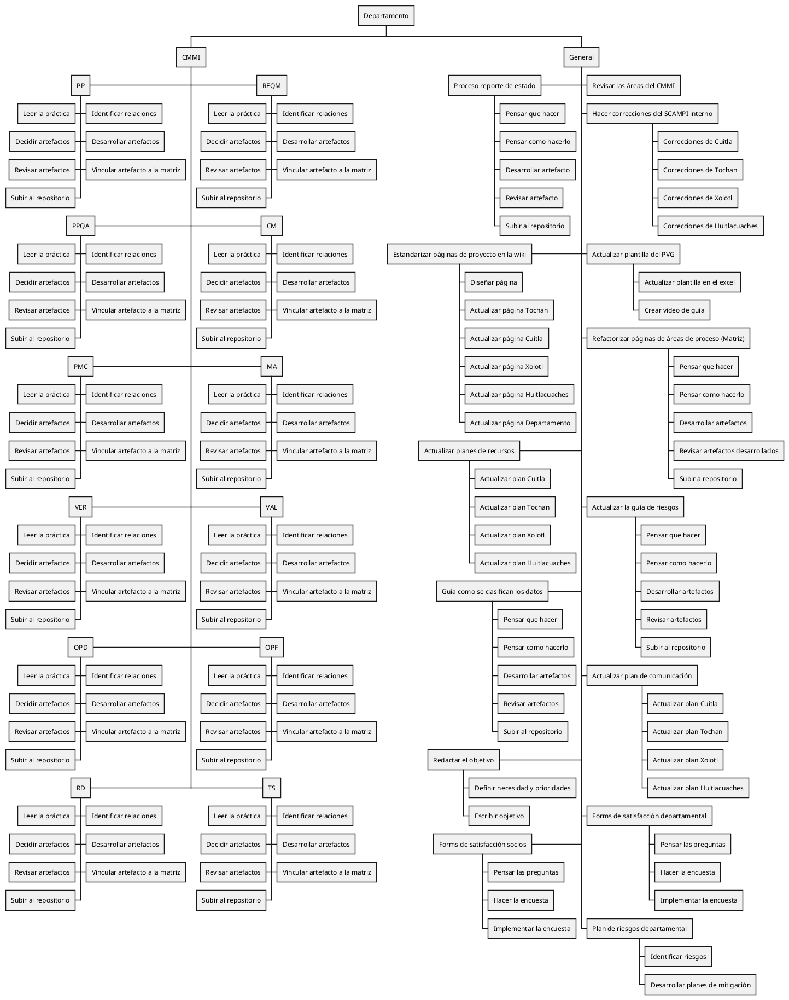

Código PUML

| Version | Creado por: | Auditado por: | Descripción | Fecha |
|---------|------------|--------------|---------------|-------|
| 1.0 | Yessica Lora,Fátima Figueroa, Kamila Martinez, Alejandra Arredondo, Fernanda Valdez | Juan Manuel Murillo    |    | 28/02/2026 |
| 2.0 | Yael Charles | Fátima Figueroa | WBS actualizado para las nuevas áreas del CMMI nivel 2 y actividades generales | 04/16/2026 |